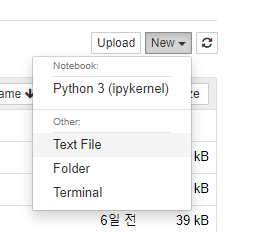

```python
def count_vowels(word):
    vowels = 'aeiou'
    result = 0
    
    for char in word:
        if char in vowels:
            result += 1
    return result
```

Homework 풀이 

```python
def only_square_area(widths, heights):
    result = []
    
    for w in widths:
        for h in heights:
            if w == h:
                result.append(w * h)
    return result
```

```python
is : 본질적으로 똑같냐 
== : 겉보기에 똑같냐! 값을 비교 
```

# 모듈(Module)

>  모듈이라는 건 파이썬 파일이다! 근데 이건 파이썬에서만 그래 

일반적으로 통용되는 모듈은 기능 단위로 묶여있는 것.

 파일들을 모아놓은 것은 폴더. 패키지는 폴더 단위다

라이브러리는 모듈과 패키지가 모여있는 것.


`__init__.py`  

패키지를 그냥 폴더인지, 모듈들을 모아두은 패키지인지 구분하는 플래그. 최신 버전은 굳이 없어도 되지만, 하위 버전 호환을 고려하여 넣어두자 


`import` 실습



새 text file 만들어서 밑에 넣기.

```python
def is_odd(n):
    return bool(n % 2)

def is_even(n):
    return not bool(n % 2)
```

클래스나 모듈 풀어해치기 `dir()`

```python
class MyClass:
    a = 1
    b = 2 
    
dir(MyClass)
```

```python
class MyClass:
    a = 1
    b = 2
dir(MyClass)

def func():
    pass
dir(func)

print(__name__) # 접글할 수 있어서 print됨 근데 내가 접근할 수 없음 
```


### 패키지

패키지는 .이라는 구성요소를 써야 함 

json이라는 패키지에 들어왔어 

```python
from .decoder import JSDecoder
# 나 스스로 이름 부를 수 없어서 .으로만 표현한 거구나!  
```

```python
# 보통 맨 아래까지 가서 하나만 import하는 것보다 어디서 가져왔는지 유추할 수 있게 적는 것이 권장됨. 1이 더 낫다 
# 1 
from my_package.math import tools
tools.e

# 2. 어디서 왔는지 잘 안 보임 
from my_package.math.tools import e
e

# 하지만 경우와 상황을 잘 따르자. 
from django.contrib.aut.decorators import is_logged_in
```

:bulb:*(동음이의어)

1. 곱셈
2. 와일드카드
3. ` * args`

```python
rm *.txt -> txt로 끝나는 모든 파일
```

```python
# standard_deviation 
# 이름이 2개가 사느냐 하나가 사느냐의 차이 
from random import choice
from random import sample as s

c = choice # c, choice 둘 다 됨
print(sample) # 안 됨 


```

